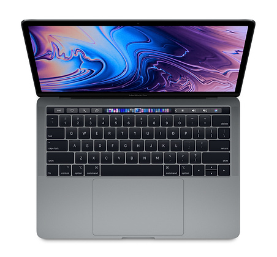

# PowerBook-100
##### ~PowerBook-99~

1. Storage 20–40 MB SCSI hard disk drive internal; external 3.5" floppy disk drive (optional)

2. Proccessor 16 MHz Motorola 68000

3. Speed 16 MHz

4. Memory RAM 2 MB or 4 MB 

[World Most Powerful Laptop](https://en.wikipedia.org/wiki/PowerBook_100 "World Most Powerful Laptop")

<dl>
  <dt>PowerBook-100</dt>
  <dd>The Laptop with no limits.</dd>
</dl>

# MacBook Pro (13-inch, 2019, Four Thunderbolt 3 ports)

1. A Proccessor 2.4 GHz Quad-Core Intel Core i5[^1]  

2. Memory 8 GB 2133 MHz LPDDR3[^2]  

3. Grpahics Intel Iris Plus Graphics 655 1536 MB[^3]  

[^1]: Much worse than the PowerBook 100

[^2]: Much much worse than the PowerBook 100

[^3]: Much much much worse than the PowerBook 100
